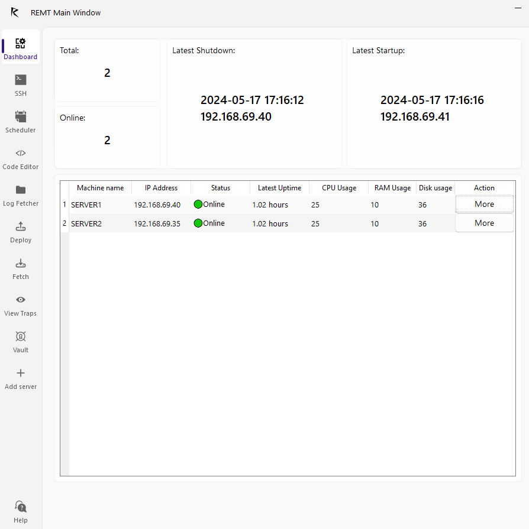

# REMT - Remote Execution and Monitoring Toolkit for Linux

**REMT** is a comprehensive toolkit designed for Linux administrators to efficiently configure and manage Linux servers. This open-source project amalgamates essential tools for remote execution, file transfers, log retrieval, task scheduling, script management, and secure password handling.

<div style="text-align: center;">
    
</div>



### Remote Execution
Allows you to open an SSH (Secure Shell) terminal to one or multiple machines simultaneously.


### File Transfer
Facilitates the deployment and download of files between the administrator's machine and remote machines.


### Log File Retrieval
Enables easy retrieval of log files from various remote machines, providing centralized access to logging data for analysis, performance monitoring, and troubleshooting.


### Task Scheduling
Allows administrators to schedule tasks to be executed automatically on remote machines.


### Creation, Editing, and Deployment of Python and Shell Scripts
Offers integrated tools to create, edit, and deploy Python and Shell scripts on remote machines.


### Secure Password Management
The software includes a robust password management system, eliminating the need for administrators to memorize or store passwords individually.


### System Monitoring
Notifies you when a machine goes online or offline, and provides real-time statistics on CPU, RAM, disk, and network usage for each machine.

## Contribution
This project is free and open-source. Anyone is allowed to use and modify it as they wish.

## Installation
To install REMT, follow the steps below:

```bash
git clone https://github.com/mohrnd/REMT.git
cd REMT
pip install -r requirements.txt
python /FinishedProduct/Startup.py
```

## Usage
To start REMT, simply execute:

```bash
python /FinishedProduct/Startup.py
```

## License
This project is licensed under the MIT License. See the [LICENSE](LICENSE) file for more details.


